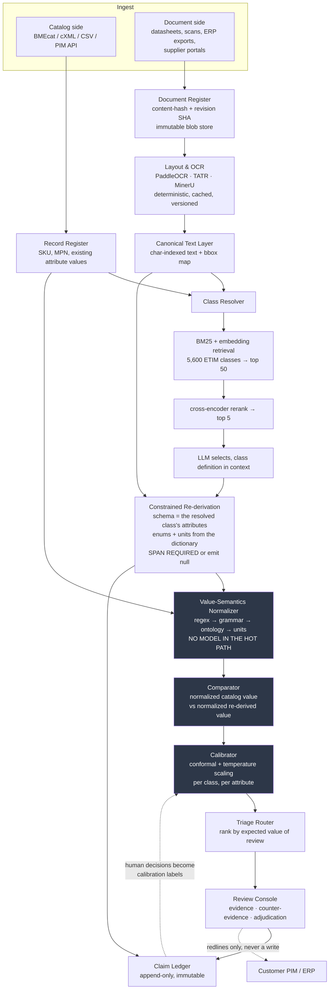

# Phase 4 — Full Spec for the Winner

**Run date:** 17 August 2026
**Input:** Phase 1 research, Phase 2 synthesis and verification, Phase 3 concepts and scoring
**Mandate from Phase 3 §5:** the fused C8/C12 verification layer, with C1, C2, C3 and C5 as components and companion artifacts
**Method:** spec built on Phase 2's verified findings plus a fresh live verification pass (§0.2). Every figure traces to a source or carries a flag.

---

## 0.1 The pick, and why not the runners-up

**The pick: the fused C8/C12 verification layer — a system that audits product data it did not produce.**

C6 dies on a dependency it cannot own: its entire value is knowing what Grainger or Sonepar will reject before they reject it, and those acceptance rules are contractual, partly tacit, differ per trading relationship, and change without notice — so every rule you get wrong produces a false pass, which is worse than shipping nothing. C15 is a brilliant onboarding trick and not a company: it runs once per customer, produces one mapping artifact, and is unverifiable by construction, because you are inferring what a consultant meant in 2003 and the customer cannot confirm your answer — that is why they hired you. The fused C8/C12 wins because it is the only top concept whose core competence — deciding what is trustworthy and what a human must see — is exactly the competence Phase 2 §C4 proved the economics depend on, and because its output is a claim about someone else's work rather than a claim of its own, which is the only position in this market that gets stronger as extraction models improve.

---

## 0.2 Verification addendum

Five claims were checked live in this pass because the spec load-bears on them. Results, including where a check failed:

| # | Claim | Result |
|---|---|---|
| V4 | ECLASS is licensed and paid | **CONFIRMED, with detail.** Using the ECLASS Standard or parts of it requires a licence. Types: **Single License** (unlimited use of one specific release), **Concordance License** (a release subscription covering published and future releases for the term), **Pay per IRDI**, or association membership — members use all licences at no additional cost. Fees are calculated by **company size, counting employees including all >50% subsidiaries** |
| V4b | ETIM is free and open | **CONFIRMED, and sharper than Phase 2 recorded.** The ETIM Classification Model and the ETIM MC extension are published under the **Open Data Commons Attribution Licence (ODC-By)** — permission to share, create derivative works, and adapt, with attribution required. Caveat Phase 2 missed: the free international format covers the coding structure and 'ETIM English' plus Belgian-Flemish, Belgian-French, German, Italian, Finnish and Norwegian — **not all local language versions** |
| V5 | UNSPSC defines no technical attributes | **CONFIRMED.** Four-level hierarchy — Segment, Family, Class, Commodity — as an eight-digit code, each level being a two-character numeric value plus a textual description, with an optional fifth Business Function level. Code, label, nothing else. There is no attribute layer to map to |
| V6 | ETIM 11.0 final release 1 Dec 2026 | **CONFIRMED.** Change-request deadline 30 Jun 2026; open change requests processed before 15 Oct 2026; a one-month beta release period; **final release planned 1 December 2026.** Worth noting the tension: ETIM's own release policy describes official releases as occurring "about every three years" and still lists 10.0 (December 2024) as current, so 11.0 arrives roughly two years after 10.0 — ahead of the stated cadence |
| V7 | ExtractBench grounding metric definition | **CONFIRMED.** A field counts as grounded-correct only when its value is accepted **and** its predicted box overlaps an accepted evidence box at **IoU 0.5** (word level) or cites the correct page (page level). New figures from this pass: the leader, LlamaExtract Agentic Plus, posts **95.6% value F1** at **8.1¢ per page**, and "VLMs and coding agents return no evidence by default, so they score zero at both grounding levels" |
| V7b | The 46.43 grounding table | **NOT RE-VERIFIED THIS PASS — carried from Phase 2.** The arXiv PDF is 5.9MB of compressed streams and no PDF text-extraction library was available locally, so the numeric leaderboard could not be re-read. Phase 2 verified it against the paper directly: 46.43 best word-level (LlamaExtract Agentic Plus), 44.14 second, 43.30 Reducto, **8 of 14 systems at 0.00**, page-level topping out at 84.92. Treat as Phase-2-verified, not double-verified |
| V8 | Name collisions | **CHECKED — two candidates killed.** Full results in §11 |

### The single most useful thing this pass produced

Put the two verified numbers for the same system side by side:

> **LlamaExtract Agentic Plus: 95.6% value F1. 46.43 word-level grounding F1.**

The best commercial extraction system in the world gets the answer right 95.6% of the time and can point at the words it came from less than half the time. Eight of fourteen systems evaluated cannot point at anything at all.

That is not a gap in extraction. Extraction is essentially solved on clean enterprise documents. It is a gap in **evidence** — and the problem statement asks explicitly for "explainable outputs." The entire product lives in the 49-point spread between those two numbers.

---

## 0.3 The load-bearing unproven assumption

*Added after Phase 5, which landed its hardest hit here.*

Everything downstream of §1 rests on one claim: **that auditing has a materially better precision/coverage operating point than extraction does at the same grounding quality.** If it does not, then a system built on models that ground correctly 46.43% of the time will show reviewers a box that does not support the claim more often than one that does — and a machine that generates confident accusations with mismatched citations at industrial scale is a more sophisticated version of the exact problem this spec claims to fix.

There are two plausible mechanisms for the asymmetry, and the architecture is designed around both:

1. **An audit runs at low coverage by choice.** It only has to be right about the disagreements it raises, and may abstain on everything else (§5.5). Extraction has to answer every field.
2. **An audit starts from a candidate value.** Confirming whether a known value appears at a known location is span *confirmation*, a substantially easier retrieval problem than open-field span discovery.

**Neither mechanism has been measured, and no number in this document quantifies either.** A spec whose governing rule is "never invent numbers" does not get credit for declining to invent this one while proceeding as though it were established.

**Consequence for sequencing, and it overrides the rest of this document:** the first thing built is not the console, the connectors, or the benchmark. It is the equivalence suite and the operating-point measurement (§13). Both are cheap, need no customer, and either can end the project inside a fortnight. Everything downstream of the comparator is well-specified work that should not begin until those two numbers exist.

---

## 1. One-liner and pitch

**One-liner:** Your product catalog is already wrong, and we can prove it — record by record, with the datasheet page open beside it.

**The 30-second pitch:**

> An industrial distributor with two million SKUs has already paid to have that catalog enriched — by an offshore team, by a BPO, or by an incumbent PIM's new AI module. At 95% accuracy that leaves a hundred thousand wrong records, and nobody knows which hundred thousand. We take the catalog and the original manufacturer datasheets, independently re-derive every attribute, and hand back a ranked list of exactly where the catalog and the evidence disagree — with a box drawn around the words on the page that prove it. We do not enrich data. We grade it. The best extraction system on the market scores 95.6 on getting values right and 46.43 on showing where they came from; we live in that gap, which means every model that gets better makes our input better instead of making us redundant.

**Why the framing matters more than the technology.** The banned-ideas list in the master prompt exists because "PDF in, attributes out" is a feature that OpenAI can delete with an endpoint. An auditor is structurally different: it consumes extraction as an input. If frontier models double in accuracy tomorrow, an extraction startup loses its reason to exist and a verification layer gets cheaper inputs and a harder, more valuable job — because the remaining errors are the subtle ones.

---

## 2. The wedge

Phase 3 §5 asked who the buyer is who did *not* create the mess. This section answers it, and names the one where the answer is weak.

### 2.1 The first user

**Primary: the person who inherited the catalog.** Four concrete personas, ranked by how little political cost your pitch imposes on them:

| Persona | Why they can hear "your data is broken" | Budget reality |
|---|---|---|
| **Compliance owner facing a dated obligation** (ESPR/DPP, REACH/RoHS SVHC declarations) | The forcing function is a regulator, not a colleague. An audit is not a judgment about anyone's competence — it is a required control | **Best combination of insulation and recurrence.** Defensible budget line, recurs annually by construction, and Phase 1 established that a missing compliance flag blocks syndication outright |
| **Post-acquisition integration lead** merging an acquired distributor's catalog into the parent's | The mess is provably not theirs, and quantifying it is how they justify their own headcount | Largest single cheque. Integration budgets are approved as deal costs, separate from IT opex, and they expire — urgency, but episodic: the window closes in nine months |
| **New head of digital / e-commerce**, first 180 days | An audit is how a new executive establishes a baseline they will later be measured against. Finding the mess is a win for them, not an indictment | Discretionary and small in the first two quarters |
| **Distributor onboarding a supplier it does not yet trust** | The suspect party is external. Zero internal politics | Real but narrow — a per-relationship spend, not a platform spend |

**Explicitly not the first user: the catalog operations manager who signed the incumbent enrichment contract.** Phase 3 named this as the most likely death and it is correct — your pitch is that their judgment produced a hundred thousand bad records, and no amount of technical quality solves that. Sell to them second, after someone else has already published the number.

**Where this answer is weak, stated plainly.** Two problems, both unresolved.

First, the compliance buyer is politically insulated but wants a *narrow* audit of the specific fields their obligation names — not the whole catalog. That is a much smaller opening contract than §10 assumes, and the path from "audit these eleven compliance fields" to "monitor two million SKUs continuously" is the same expansion story every failed enterprise-tools company told its investors. Second, the arithmetic underneath the whole table: the personas with clean politics are episodic, and the persona with the recurring budget line is the one your pitch attacks.

**Neither is solved here.** Both are carried into Phase 5 as testable assumption **A6**, which is cheap — fifteen structured conversations asking what someone has budget to sign this quarter, not whether the problem is real. Run it in parallel with the technical kill tests (§13).

### 2.2 The first product category

**Low-voltage circuit protection — MCBs, RCBOs, RCCBs — classified in ETIM.**

Six reasons this is the right first cut, all traceable:

1. **Densely parametric.** Rated current, number of poles, tripping characteristic (B/C/D), breaking capacity, rated voltage, IP rating. Every one is a controlled value with a unit, which means disagreements are unambiguous rather than matters of opinion.
2. **Safety-critical.** Phase 1's sharpest line is Kimi's: a wrong circuit-breaker spec is "a fire, a lawsuit, a terminated contract — and the model will tell you it is 98% confident while doing it." When an audit finding lands here, nobody argues about whether it matters.
3. **ETIM's home territory.** ETIM originated in electrical and is dominant there; ETIM 10.0 defines 5,600+ product classes across electrical, HVAC/plumbing, building materials, tools and marine.
4. **The standard is legally usable.** V4b confirms ODC-By — you may adapt and redistribute derivative works with attribution. Starting anywhere ECLASS-dominant would put a licence gate in front of your open-source strategy on day one.
5. **The source documents are public.** Schneider, ABB, Siemens, Legrand, Eaton and Rockwell all publish datasheets openly. You can build the gold set, run the demo, and prove the product without a signed customer — which is the difference between a spec and a demo.
6. **The buyers are named and reachable.** Phase 2 verified Sonepar, Graybar, WESCO, Rexel and McNaughton-McKay as ETIM adopters, and IDEA — jointly owned by NEMA and NAED — serves 80 of the top 100 US distributors through IDEA Connector.

**Second category, once the first is working: fasteners and MRO hardware.** Every compound-value example in the research lives there — `M8 × 1.25`, `3/8-16 UNC`, `6061-T6`, `316 SS = A4 = 1.4401`. It is the hardest showcase for the value-semantics library and the worst place to start, because the disagreements are semantic rather than numeric and the false-positive risk is highest.

### 2.3 The first workflow — and the answer to Phase 3's open question #2

Phase 3 asked what happens when source documents are missing. The answer is that it becomes the first deliverable rather than a caveat.

**The Groundable Fraction Report.** Before a single attribute is audited, the system inventories the catalog against retrievable evidence and reports:

```
Catalog:                    412,880 SKUs / 14.2M attribute values
Source document located:    251,140 SKUs  (60.8%)
  – manufacturer current:   198,400
  – manufacturer archived:   41,900
  – distributor-derived:     10,840   [lower evidentiary rank]
No retrievable source:      161,740 SKUs  (39.2%)
  – manufacturer delisted:   88,300
  – supplier feed only:      54,100   [no primary document ever existed]
  – ambiguous MPN:           19,340

AUDITABLE:      60.8% of catalog
UNDEFENDABLE:   39.2% of catalog — no evidence exists to support or refute these values
```

Three things make this the right opening move rather than an admission of limits:

- **It is a finding, not a failure.** The 39.2% is a list of records that cannot be defended to an angry customer or a regulatory auditor. Kimi's line — "without provenance they cannot defend a spec to an angry customer or a regulatory auditor; you have built a liability engine" — applies to the customer's existing catalog, and this report is the first time anyone has quantified it for them.
- **It scopes the engagement honestly before money changes hands.** You are telling the buyer what you cannot do, in writing, in advance. Against a market where Phase 1 shows vendors quoting confident accuracy numbers with no provenance, that is the differentiating sales motion, not a weakness.
- **It creates the document-recovery product.** The ungroundable set is a work queue: manufacturer sites, archived revisions, ETIM/IDEA data pools, supplier portals. Recovery converts undefendable records into auditable ones and is separately billable.

**The honest limit:** for the oldest, highest-value, most obsolete tail — precisely the C4 tail where the value is — sometimes no evidence exists anywhere and the correct output is "we decline, and here is why." The product must say that out loud rather than manufacture a confident answer. That is the whole thesis applied to itself.

---

## 3. System architecture

### 3.1 The inversion

Every banned idea in the master prompt shares one shape: `document → model → structured output`. This system runs a different shape entirely:

```
(existing catalog record) + (source document corpus)
        → independent re-derivation
        → normalized comparison
        → ranked disagreements with evidence
```

The catalog is not the output. **The catalog is one of two inputs, and it is the input under suspicion.**

### 3.2 Components



### 3.3 The comparator — the actual novel component

Everything upstream of the comparator exists in some form on the market. The comparator does not, and it is where the product is won or lost. Its job is not "are these two strings different" — that question produces a false-positive avalanche that ends the pilot in week one. Its job is to classify *how* they differ:

| Disagreement class | Example | Action |
|---|---|---|
| **Contradiction** | Catalog `63 A`; datasheet table cell `6 A` | Flag. Highest severity. This is the poisoned record |
| **Unsupported value** | Catalog `IP67`; no evidence anywhere in the corpus | Flag as undefendable — value may be right, but it cannot be defended |
| **Catalog null, evidence present** | Catalog blank; datasheet states `10 kA` | Flag as recoverable gap. This is the fill-rate finding |
| **Unit-frame mismatch** | Catalog `0.5 in`; datasheet `12.7 mm` | Resolve silently. Same fact, different frame |
| **Precision mismatch** | Catalog `10 mm`; datasheet `10 ±0.2 mm` | Flag as low severity — the tolerance was dropped, which matters for fit and not for search |
| **Semantic equivalence** | Catalog `316 SS`; datasheet `A4`; ERP `1.4401` | **Do not flag.** Same material, three vocabularies |
| **Granularity mismatch** | Catalog `Threaded`; datasheet `NPT 1/2-14` | Flag as under-specified, not as wrong. Kimi's schema-hallucination failure, detected from the other side |
| **Packaging-frame error** | Catalog `Each`; datasheet/pack data `Box of 10` | Flag at maximum severity. Phase 1: catch this wrong once and "you will never get another meeting" |

Semantic equivalence is the row that decides the company. An auditor that flags `316 SS` against `A4` as an error is not a weak product — it is an actively harmful one, because it burns the reviewer's trust in the first session and there is no second session. Which is why the next component has no model in it.

### 3.4 Where deterministic code beats an LLM, and why

This table is the architectural spine, and the reasoning column matters more than the assignment column.

| Task | Implementation | Why not an LLM |
|---|---|---|
| Unit conversion | Pint, extended | A conversion is arithmetic with a known answer. A model that gets it wrong is wrong *plausibly*, and plausible-wrong is unfalsifiable at review time |
| Compound-value parsing (`M8 × 1.25`, `3/8-16 UNC`, `10 ±0.2 mm`) | PEG/Lark grammar → typed struct | **A grammar either parses or refuses. Refusal is a signal you can route. An LLM always returns something, so its failure is silent** |
| Material identity (`316` = `A4` = `1.4401`) | Curated ontology with equivalence classes | The equivalence set is finite, knowable, and testable. Asking a model to re-derive a known fact per call is paying rent on a lookup table |
| Enum and schema validation | ETIM dictionary value lists | The valid set is published. Constrained decoding, not judgment |
| GTIN / check digits | Modulo arithmetic | Self-evidently |
| Cross-standard class lookup | Versioned mapping tables | Auditability. A mapping must be inspectable and diffable by a human, which a model's reasoning is not |
| Document revision diffing | Content hashing | Deterministic by definition |
| **Span localization in messy layout** | **VLM / layout model** | Genuinely hard perception; no rule system reads a rotated multi-column page |
| **Multi-column product disambiguation** | **LLM with layout features** | Phase 1's named failure: the model merges the left and right product into one record. Requires reasoning over visual grouping |
| **Drawing callout → dimension association** | **VLM** | Phase 1 rates this research-only, and it is |
| **Attribute *name* equivalence** (`Rated Voltage` ≈ `Nominal Supply Voltage`) | **Embedding + reranker + LLM** | Open-vocabulary semantics with no enumerable answer set. The one place induction genuinely beats rules |

The pattern: **LLMs are used for perception and open-vocabulary judgment; deterministic code is used for anything with a knowable right answer.** Phase 1's most important sentence — "almost nobody uses pure LLMs; instead: candidate retrieval → reranker → LLM" — is implemented literally in the class resolver, which narrows 5,600 ETIM classes to 50 by retrieval, to 5 by cross-encoder, and only then asks a model to choose with the class definition in context.

### 3.5 Cost shape

The audit runs in tiers so cost tracks disagreements rather than SKUs — the direct answer to Phase 2 §C4:

| Tier | Runs on | Cost driver |
|---|---|---|
| **T0 — structural** | 100% of records | Cheap. Schema conformance, enum validity, unit sanity, packaging-frame sanity. No document read |
| **T1 — grounded re-derivation** | Records with a located source document | Dominant cost. ExtractBench's verified 8.1¢/page for the leader is the reference point for what a grounded page-read costs today |
| **T2 — adjudicated deep read** | Only T1 disagreements | Self-consistency voting, multi-model cross-check, higher-resolution re-read |
| **T3 — human review** | Only what the triage router surfaces | Reviewer-seconds. The unit nobody prices (Phase 2 §B2) |

The economics claim this rests on: **T2 and T3 volume scales with the error rate, not the catalog size.** A cleaner catalog is cheaper to audit. That is the opposite of enrichment pricing and it is the whole reason the C4 objection lands differently here.

---

## 4. The data model

### 4.1 The Claim is the atomic unit

Nothing in this system stores "the value of attribute X for SKU Y." It stores immutable, append-only *claims about* that value, each carrying who asserted it, from what, and how sure they were.

```
Claim {
  claim_id            uuid          -- immutable, never reused
  sku_id              text
  mpn                 text
  attribute_uri       text          -- etim:EF000123 | eclass:0173-1#02-AAO662 | customer:MAT_GRADE
  class_uri           text          -- etim:EC000042 @ release 10.0

  -- the value, twice
  value_raw           text          -- exactly as it appeared: "M8 x 1.25"
  value_normalized    jsonb         -- { kind: "thread_metric",
                                   --   nominal_diameter: {mag: 8, unit: "mm"},
                                   --   pitch: {mag: 1.25, unit: "mm"},
                                   --   designation: "M8x1.25",
                                   --   grammar_version: "thread/1.4.0" }

  -- evidence: empty array is a hard failure, never a guess
  evidence            jsonb[]       -- [{ doc_id, doc_revision_sha256, page,
                                   --    bbox: [x0,y0,x1,y1], char_span: [1841,1851],
                                   --    snippet: "...thread M8 x 1.25...",
                                   --    extraction_layer_version }]

  -- who derived it, reproducibly
  asserter_kind       enum          -- source_feed | extractor | human | policy
  extractor           jsonb         -- { name, version, model_id, prompt_sha256,
                                   --   params_sha256, decode_constraints_sha256 }

  -- how sure, honestly
  confidence          jsonb         -- { raw_score, calibrated_p,
                                   --   calibration_set_id, method: "conformal|platt",
                                   --   abstained: bool, abstain_reason }

  asserted_at         timestamptz
  supersedes          uuid?         -- prior claim this replaces
  status              enum          -- active | superseded | retracted | disputed
}
```

**The hard invariant, enforced at the type level and not by policy:** a claim with an empty `evidence` array cannot be constructed by an extractor. Phase 1's imperative — *"no provenance → reject"* — is not a validation rule that can be relaxed under deadline pressure. If the extractor cannot produce a span, it emits an abstention with a reason, which is a different object entirely.

### 4.2 Conflict resolution by declarative policy

Last-write-wins is how catalogs get poisoned. Every resolution runs through a **versioned, human-readable policy document**, and the resolved value stores which policy version resolved it:

```yaml
policy_id: electrical-conservative
version: 3
source_rank:                      # higher wins
  - manufacturer_datasheet_current:   100
  - manufacturer_datasheet_archived:   80
  - manufacturer_api_feed:             75
  - etim_datapool:                     60
  - distributor_feed:                  40
  - scraped_product_page:              20
rules:
  - name: prefer_higher_rank
  - name: recency_within_rank
    window_days: 400
  - name: prefer_more_specific
    note: "NPT 1/2-14 beats Threaded; never the reverse"
  - name: tolerance_never_dropped
    note: "10 ±0.2 mm supersedes 10 mm; a bare value never supersedes a toleranced one"
  - name: safety_class_override      # the important one
    attributes: [breaking_capacity, rated_voltage, tripping_characteristic,
                 material_grade, temperature_rating, packaging_uom]
    action: ESCALATE_TO_HUMAN        # no automated resolution, ever, at any confidence
  - name: equal_rank_conflict
    action: ABSTAIN_AND_SURFACE_BOTH
```

Two consequences worth naming. First, when a customer asks "why does this field say 6 A," the answer is a chain: this claim, from this document revision, resolved by policy v3 rule `prefer_higher_rank` over that claim. That is a defensible audit trail rather than an opinion. Second, the policy is a customer-editable artifact — which converts the argument "your tool disagrees with our conventions" from a product objection into a configuration change.

### 4.3 The system does not write to the customer's catalog

Default output is a **Redline** — a proposed change with evidence, addressed to a human:

```
Redline {
  redline_id, sku_id, attribute_uri
  catalog_claim_id      -- what they have now
  proposed_claim_id     -- what the evidence supports
  disagreement_class    -- from §3.3
  severity, blast_radius_score, expected_review_value
  counter_evidence      -- best support found FOR the catalog's value, or explicit null
  adjudication          -- { decision, decided_by, decided_at, note } | pending
}
```

Write-back to a PIM exists only in v2, only behind a per-attribute approval gate, and never for a safety-class attribute (ADR-001). Phase 1's finding was categorical: catalog ops demands a human gate on "every single write. Not a sample. Not a confidence threshold. Every. Single. Write." Architecture is the only place that promise can be kept credibly — a policy setting can be changed by a sales engineer under pressure.

**Who owns a wrong redline that a human accepted.** *Added after Phase 5, which was right that the spec had no position on this.* The audit-only posture does not remove liability — it distributes it, and it would be dishonest to present the human signature in the middle as though it were moral cover rather than contractual cover. If the system claims a rated current is wrong, a reviewer accepts on the strength of the evidence shown, and the system was wrong, then a live catalog has been broken *by a finding*, and the customer will not care that they clicked the button. Three commitments follow, and they are product requirements rather than legal boilerplate:

1. **Every accepted redline is reversible from the ledger.** The superseded claim is never destroyed, so a full rollback of any audit batch is a query, not a recovery project.
2. **The safety-class list is never auto-applied and never single-signature.** Attributes in that list require a second named adjudicator, and the second reviewer sees the counter-evidence panel first.
3. **The evidence shown is the evidence of record.** If a reviewer accepted on the basis of a box, that box, that document revision hash, and that policy version are retained immutably — so the question "what was this person actually looking at" has one answer forever. This protects the reviewer as much as the vendor, and it is why §5.2's rendering must be reconstructible from stored state rather than regenerated at view time.

---

## 5. The explainability layer, concretely

The problem statement demands explainable outputs. Phase 1 established what does *not* count: Kimi's *"they know that '92% confident' is a meaningless number when the 8% error rate clusters on the most expensive, most safety-critical SKUs."* Here is what is on screen instead.

### 5.1 Left pane — the queue, ranked by expected review value

Not sorted by confidence. Sorted by **expected value of the human's next thirty seconds**:

```
expected_review_value = P(catalog is wrong | evidence) × blast_radius

blast_radius = revenue_weight          -- SKU revenue × category filter usage
             × safety_class_multiplier -- fire/injury exposure
             × propagation_count       -- faceted filters + punchout feeds
                                       --   + compliance exports touched
             × record_multiplicity     -- how many SKUs share this error signature
```

A queue row reads as a sentence, not a score:

> **⚠ SEV-1 · MCB-63C-2P · Rated current**
> Catalog says **63 A**. Manufacturer datasheet rev. C, page 4, current-rating table, says **6 A**.
> **1,240 SKUs in ETIM class EC000042 share this pattern** — a decimal-shift signature.
> This attribute feeds **3 faceted filters**, **1 punchout catalog**, and the **ESPR export**.
> Est. review time 40 s · Est. blast radius **£/$ high** · Evidence: word-level box available.

`revenue_weight` operationalizes Phase 2's most quotable verified finding: a distributor can sit at 71% completeness overall while being at 34% on the twelve attributes buyers actually filter by in its three best-selling categories. Completeness is vanity; fill rate on revenue-weighted required attributes is the metric.

### 5.2 Center pane — the evidence, at word level

The source document renders with the **exact word-level bounding box highlighted at IoU-0.5-comparable precision**, the containing table cell outlined, and the row and column headers that give the cell its meaning highlighted in a second colour — because a number in an engineering table means nothing without its header, and a system that boxes `6` without boxing `Rated current (A)` has not explained anything.

Reviewer controls that matter: jump to the raw page, toggle the OCR layer to see what the machine actually read, and view the document revision history so a stale-source disagreement is visibly a stale-source disagreement.

### 5.3 Right pane — claim history and the counter-evidence panel

The full lineage of the attribute: every claim ever asserted, by what, from which document revision, when, with what calibrated confidence, and which policy rule selected the current winner.

Then the component that earns trust, and the one competitors will not build:

> **Counter-evidence — support found for the catalog's value of 63 A**
> Distributor product page (rank 20), captured 12 Mar 2026: lists "63A". Derived from the same feed under audit — **not independent**.
> Manufacturer datasheet rev. B (superseded), page 4: `6 A`.
> **No independent evidence supports 63 A.**

When the system disagrees, it must argue the other side first, or state plainly that it cannot. An auditor that only shows evidence for its own conclusion is a prosecutor, and a reviewer learns to distrust a prosecutor by the third screen. Sometimes the counter-evidence panel will be strong enough that the reviewer keeps the catalog value — and that is the feature working, not failing.

### 5.4 Adjudication, and how disputes resolve

Three actions: **Accept redline** · **Keep catalog** · **Escalate**.

Every one writes a new human-asserted claim into the ledger. Three consequences:

1. **Human decisions are calibration labels.** They flow back into the calibrator (§3.2) as ground truth for this customer, this class, this attribute.
2. **"Keep catalog" with zero supporting evidence is the highest-signal event in the system.** The reviewer knows something the corpus does not — a supplier email, a tribal correction, a private revision. Each one is a document-recovery lead and a systematic false-positive signal.
3. **Escalation routes by attribute, not by seniority.** A tripping-characteristic dispute goes to whoever owns electrical, with the evidence, the counter-evidence and the policy chain attached — not to a manager who must re-derive the context from scratch.

### 5.5 Abstention is a visible bucket, not a silent skip

Every audit reports a **Declined** set with a stated reason per record, because a system that quietly skips what it cannot handle is indistinguishable from one that handled it:

| Reason | Meaning |
|---|---|
| `no_source_document` | Nothing to ground against (feeds the §2.3 recovery queue) |
| `layout_unreadable` | Fold-out page, rotated table, cross-page table split. Phase 1 rates fold-outs "almost impossible automatically" |
| `ambiguous_multi_product_page` | Cannot determine which of several products on the page the value belongs to |
| `value_outside_known_grammar` | The value-semantics library refused to parse — deliberately surfaced, never guessed |
| `equal_rank_source_conflict` | Two sources of identical evidentiary rank disagree; policy declines to arbitrate |
| `calibration_out_of_distribution` | This class has too few labels for the confidence estimate to be honest |

`calibration_out_of_distribution` is the one no competitor will ship: the system declaring that it does not yet know how much to trust itself in this region.

---

## 6. The evaluation harness and the benchmark contribution

### 6.1 Internal harness

Every merged change runs the full harness. Three properties are non-negotiable:

- **A frozen hard-tail split that never enters the tuning loop.** Phase 2 §6 banned demoing on the clean 80%; the same ban applies to *evaluating* on it. The tail split is degraded scans, fold-outs, cross-page tables, superseded revisions and handwritten amendments.
- **Calibration drift alarms.** A drop in accuracy is a bug. A drop in *calibration* — the model becoming confidently wrong — is an incident, because the entire product is the confidence estimate.
- **False-positive rate as a release gate, with a number.** *Revised after Phase 5, which correctly attacked the absence of a target.* The gate is **under 2% false positives on the semantic-equivalence suite**, measured on flagged records. A build that raises it fails regardless of what it does to recall. The arithmetic that sets the threshold: a sweep surfacing 40,000 redlines at a 15% FP rate wastes 6,000 reviews, and at Phase 2's verified $20–$35/hour for specialised review even 40 seconds a decision spends thousands of the customer's dollars proving your tool is wrong — inside the pilot, in front of the person who approved it. **Above roughly 5%, the product does not ship at any quality of everything else.**

### 6.2 The benchmark contribution (C2) — narrowed exactly as Phase 2 demanded

Phase 2 killed the naive H2 ("ship the first extraction benchmark") — ExtractBench owns generic schema-guided extraction with grounding and cost, and it is Apache 2.0 with a public dataset and open harness. What survives is precisely specified:

**Deliberate compatibility.** Reuse ExtractBench's grounding metric verbatim — a field is grounded-correct only when its value is accepted **and** its predicted box overlaps an accepted evidence box at **IoU 0.5** (V7, confirmed). This is a strategic choice, not a technical one: it makes results directly comparable to a published leaderboard whose best word-level score is 46.43 and where 8 of 14 systems score 0.00. You do not want a metric of your own that nobody can check you against.

**Then score the five axes ExtractBench does not:**

| Axis | Task | Why it is absent from every existing benchmark |
|---|---|---|
| **Class assignment** | Choose the correct ETIM class from 5,600+ | ExtractBench *hands* the system its schema. The industrial problem is retrieving the right one first |
| **Compound-value semantics** | `M8 × 1.25`, `3/8-16 UNC`, `10 ±0.2 mm`, `IP67`, `6061-T6`, `316`≡`A4`≡`1.4401` | Phase 2 verified ExtractBench's normalization is date canonicalization and whitespace collapsing |
| **Cross-standard mapping** | ETIM ↔ UNSPSC attribute bridge correctness | The documented hole (V5): UNSPSC has no attribute layer at all |
| **Supersession reasoning** | Old MPN → new MPN, variants, equivalences | Phase 1 rates this research-only with no production-proven system |
| **Calibrated abstention** | **Full risk–coverage curve, AURC, selective accuracy at fixed coverage** | The one axis nothing scores. Phase 2: null-on-blank is not abstention — abstention is declining a field whose value *is* present but ambiguous |

**Plus two axes nobody has defined.**

**Reviewer-seconds-per-verified-attribute** (Phase 2 §B2). A timed protocol — annotators of stated domain competence adjudicate a fixed queue under each interface condition, and the harness reports seconds-to-decision and decision accuracy. It converts "explainable" from an adjective into a measurement, and it is what the buyer actually pays for.

**Evidence-acceptance rate** — *added after Phase 5, and it may be the most important number in the harness.* The fraction of redlines whose evidence box a domain reviewer accepts as genuinely supporting the claim. This is distinct from grounding F1 against a gold box, and it is the metric that captures the failure Phase 5 identified: at 46.43 word-level grounding, more than half of a naive system's boxes point at the wrong words, and a reviewer *sees that instantly*. A wrong box is self-revealing, which is architecturally better than a wrong value with no box — but it converts a correctness failure into a trust tax, and trust taxes compound. If evidence-acceptance is low, no amount of value accuracy saves the product, because the reviewer stops believing the screen.

**Distribution, with the legal problem named.** Manufacturer datasheets are copyrighted. Redistributing the PDFs is not defensible, so the release follows the WDC pattern: **URLs, content hashes, page-level annotation layers, bounding-box coordinates and gold values — never the source documents.** A fetch script reconstructs the corpus locally. ETIM class and attribute references are redistributable under ODC-By with attribution (V4b). No ECLASS content ships in the public set (ADR-003).

---

## 7. ADRs for the three highest-stakes decisions

### ADR-001 — Audit-only output vs. write-back enrichment

**Context.** The system re-derives values with evidence. It would be trivially easy — and commercially tempting — to write them into the customer's PIM. Phase 1 is categorical that catalog ops refuses batch auto-publishing, having "been burned by overnight scripts turning 4,000 SKUs into unsearchable sludge," and demands a human gate on every single write. Meanwhile the buyer's stated desire is fewer manual steps.

**Options considered.**

| Option | Complexity | Cost | Scalability | Maintenance | Trust posture |
|---|---|---|---|---|---|
| **A. Full enrichment suite with auto-publish** | High — becomes a PIM | High | Blocked by review, not compute | Owns every downstream break | Fails Phase 1's hard requirement outright |
| **B. Audit-only; emit redlines; never write** | Low | Low | Scales with disagreements, not SKUs | Small blast radius | Strongest — you cannot corrupt what you cannot write |
| **C. Audit + gated per-attribute write-back behind explicit approval** | Medium | Medium | Good | Connector matrix per PIM | Strong if the gate is architectural, weak if configurable |

**Decision: B for v1, C for v2** — with write-back permanently excluded for any attribute in the safety-class list, at any confidence, with no configuration override.

**Consequences.**
*Easier:* the pilot conversation, because you cannot break their catalog; liability, because you never assert into production; the demo, because a redline is more legible than a diff. *Harder:* proving ROI, since the customer must still spend reviewer-seconds — which is exactly why reviewer-seconds is the headline metric (§6.2); and resisting the sales pressure that will arrive in month four asking for auto-apply on "high-confidence" fields. *Revisit when:* a customer has run six months of adjudications and their own accept-rate data justifies a narrow, non-safety, per-attribute auto-apply — their number, not yours.

### ADR-002 — How grounding is represented

**Context.** Word-level evidence is the product. The representation choice determines whether evidence survives a parser upgrade, whether it is comparable to published benchmarks, and whether a reviewer can act on it.

**Options considered.**

| Option | Complexity | Cost | Scalability | Maintenance | Reviewer utility |
|---|---|---|---|---|---|
| **A. Page-level citation only** | Low | Low | High | Trivial | Poor — the field's best page-level score is 84.92 while word-level is 46.43, so page-only hides the actual difficulty |
| **B. Word-level bbox only** | Medium | Medium | Good | **Brittle** — every OCR/layout upgrade invalidates stored coordinates | Excellent, until the parser changes |
| **C. Char span on canonical text only** | Medium | Low | Good | Stable | Poor for scans — no visual anchor to point at |
| **D. Dual anchor: char span primary + derived bbox projection** | High | Medium | Good | Bbox is regenerable from the span | Excellent and durable |

**Decision: D.** The char span on the canonical text layer is the primary, stored anchor. Bounding boxes are a *projection* of that span through the versioned layout map, regenerated when the extraction layer is upgraded.

**Consequences.**
*Easier:* upgrading OCR without invalidating history — coordinates are recomputed, claims are not; diffing evidence across document revisions; reporting an IoU-0.5 word-level score comparable to ExtractBench. *Harder:* the canonical text layer becomes critical infrastructure needing its own versioning and reproducibility guarantees; born-digital PDFs and scans need separate projection paths; a span-to-bbox projection failure is a new error class to handle. *Revisit when:* a customer needs evidence rendered inside a viewer that only accepts static coordinates, or a document type appears where char spans are meaningless — a pure dimension drawing with no text layer at all.

### ADR-003 — Cross-standard mapping under asymmetric licensing

**Context.** This is the ADR Phase 2 §B1 prevented from detonating. V4b confirms ETIM's Classification Model and MC extension are published under the **Open Data Commons Attribution Licence** — share, adapt, redistribute derivatives, with attribution. V4 confirms **ECLASS requires a licence**, priced by company size, via single-release, concordance, pay-per-IRDI or association membership. ECLASS 16.0 carries roughly 50,000 classes and 23,000 properties and is the richer target. The open-source strategy needs a mapping asset; half the map has a licence gate.

**Options considered.**

| Option | Complexity | Cost | Scalability | Maintenance | Legal exposure |
|---|---|---|---|---|---|
| **A. Ship ETIM + ECLASS mappings openly** | Low | Low | High | Moderate | **Unacceptable — redistributes licensed content** |
| **B. ETIM-only open; ECLASS via bring-your-own-licence adapter** | Medium | Low | High | Two code paths | Clean. Customer's licence, customer's data, your code |
| **C. Buy an ECLASS licence, ship the map closed** | Medium | Recurring fee scaling with your headcount | High | Single path | Clean but kills the open contribution |
| **D. Join ECLASS e.V. as a member** | Low | Membership fee | High | Single path | Clean, plus standards-body access — but membership terms are not redistribution rights |

**Decision: B, with D as a deliberate later move.** Ship openly: the ETIM class and attribute layer (ODC-By, attributed), and the **ETIM ↔ UNSPSC attribute bridge** — the specific documented hole, since V5 confirms UNSPSC provides an eight-digit code with no attribute layer, so anyone wanting parametric filtering from a UNSPSC-classified catalog must build that bridge themselves. ECLASS support ships as an adapter that reads the customer's own licensed dictionary files at runtime; no ECLASS content in the repo, the container image, or the benchmark set. Pursue ECLASS e.V. membership once revenue exists, for standing in the standards process rather than for redistribution rights.

**Consequences.**
*Easier:* publishing without legal review on every release; the ETIM↔UNSPSC bridge becomes a genuine free contribution to a real hole rather than a repackaging of someone's licensed asset; ETIM-region adoption. *Harder:* ECLASS-first customers — largely German industrial and Siemens Teamcenter shops — need a licence before onboarding, which is a real sales-cycle tax; two mapping code paths to maintain; the free ETIM tier does not include all local language versions (V4b), so multi-language customers hit a gap you did not create and must still explain. *Revisit when:* ECLASS licensing terms change, or a customer's own licence permits derivative redistribution that would let a shared map exist legally.

---

## 8. What makes this genuinely hard

Three problems. The first is the company.

### 8.1 False-positive suppression under semantic equivalence

An auditor's output is an accusation, and accusations have an asymmetric error cost that has no analogue in extraction. A missed error costs one bad record. A false accusation costs the reviewer's trust — and Phase 1 is explicit that trust, once lost, ends the relationship: catch a UoM wrong once and "you will never get another meeting."

So the system must know, reliably, that `316 SS` and `A4` and `1.4401` are one fact; that `0.5 in` and `12.7 mm` agree; that `Threaded` is not *wrong* relative to `NPT 1/2-14`, merely coarser; and that `10 mm` versus `10 ±0.2 mm` is a dropped tolerance rather than a contradiction. Each of those is an ontology commitment across materials, threads, tolerances, ingress codes, packaging frames and unit systems, at long-tail entropy — Kimi's *"the hard part was never extraction; the hard part is normalization at the edge of long-tail entropy."*

**Why it is unusually hard here:** there is no benchmark for it, so there is no baseline to beat and no published number to hide behind. You are building the measurement and the thing being measured at once, which is also why §6.2 exists.

### 8.2 Grounding documents that resist grounding

46.43 word-level grounding F1 is the state of the art **on 370 clean enterprise documents** — SEC filings, tax forms, procurement paperwork. The C4 tail is not that. It is fold-out pages that Phase 1 rates "almost impossible automatically," tables spanning page breaks, rotated engineering tables, scanned amendments over printed values, multi-column catalog pages where the model merges the left and right product into one record, and dimension callouts requiring OCR plus geometry plus association — rated research-only.

**The compounding difficulty:** the tail is simultaneously where the value is (C4), where grounding is worst, and where source documents are most often missing (§2.3). Three independent difficulties correlate perfectly and all point at the same records. The honest architectural answer is abstention with a stated reason (§5.5), which is a real answer and also a smaller product than the pitch implies.

### 8.3 Calibration under distribution shift

The product *is* the confidence estimate. If `calibrated_p = 0.9` does not mean nine in ten, the triage router mis-ranks, the abstention curve is decoration, and the reviewer is back to Kimi's meaningless 92%.

Calibration fitted on circuit protection will not transfer to hydraulic fittings, and calibration fitted on Schneider's datasheet house style will not transfer to a 1998 scan. This demands per-class, per-customer, per-document-family recalibration on tiny label budgets — conformal prediction with class-conditional coverage, active learning to spend the label budget where coverage is thinnest, and drift detection that fires on *calibration* degradation rather than accuracy degradation. Every model upgrade invalidates the calibration set, which means the upgrade cadence is governed by relabelling cost, not by model availability.

**This is probably the product's ceiling, not merely a risk.** *Revised after Phase 5.* Count the cells: 5,600 ETIM classes, dozens of attributes each, several document families per manufacturer. Conformal prediction with class-conditional coverage needs a floor of labels per cell to be honest, and under any realistic labelling budget **most cells will never reach it.** The consequence is uncomfortable and follows directly from the design's own integrity: `calibration_out_of_distribution` — the abstention reason this spec is proudest of — fires across the large majority of the catalog, and effective coverage collapses to the well-labelled classes. The most honest feature in the system is the one most likely to eat the product.

The mitigations are real and partial: hierarchical pooling of priors up the ETIM tree so a sparse class borrows from its parent; attribute-type pooling across classes, since "rated current" behaves similarly wherever it appears; and treating coverage as a *sold* quantity — the customer buys coverage in the classes that matter to them, and the label budget is spent there deliberately rather than spread thin. **Assumption A8 in Phase 5 tests this with arithmetic alone, before any code: take a real catalog's class distribution and compute how many classes clear the label floor. If the answer is single-digit percentages, the abstention-first design is a ceiling and the product must be re-scoped around a narrow set of high-volume classes rather than a catalog-wide audit.**

---

## 9. Open-source strategy

### 9.1 The split

**Apache-2.0** — matching ExtractBench, which is Apache 2.0 with a public dataset and an open harness, so the ecosystem you want to be cited by can adopt yours without a licence conversation:

| Open component | Why open |
|---|---|
| **Value-semantics library (C1)** | The unfilled gap Phase 1 named explicitly: Pint and Quantulum3 "need substantial extension for industrial engineering." Deterministic, exhaustively testable, useful to everyone, and worthless to a competitor without the rest of the system |
| **Benchmark + eval harness (C2)** | A benchmark nobody can run is marketing. Open harness, open gold set, published leaderboard including your own losses |
| **Claim schema + reference implementation (C3)** | A provenance format only becomes an interchange standard if it is free. Adoption by a PIM vendor is a win, not a leak |
| **ETIM ↔ UNSPSC attribute bridge** | Fills the documented hole (V5), legally clear under ODC-By (V4b) |
| **Comparator core with the disagreement taxonomy** | The taxonomy is the intellectual contribution; the tuned models and pattern corpus behind it are not in the repo |

**Commercial:** the hosted audit console and reviewer workflow; PIM/ERP connectors (Akeneo, Salsify, Syndigo, inRiver, SAP, Teamcenter); the calibration service and managed calibration sets; the disagreement-pattern corpus; managed document-corpus acquisition and freshness monitoring; reviewer analytics and the ROI reporting a buyer needs to renew.

### 9.2 Where the compounding asset lives — Phase 3's open question #3

Phase 3 was explicit that the moat argument must rest entirely on cross-customer assets, and it is right. Stated plainly:

**Three assets compound, and all three are shared across customers:**

1. **The value grammar library.** Every new compound-value form ever encountered, parsed deterministically, regression-tested. Cross-domain and cumulative. A grammar written for a German fastener catalog works for an Indian one.
2. **The disagreement-pattern corpus.** This is the non-obvious one. Errors are not random — they have *signatures*. A decimal shift in a specific manufacturer's rated-current column. A packaging-frame collapse that appears whenever a particular BPO processed the feed. A specific datasheet revision whose table structure causes a systematic OCR misread. Every audit at every customer makes the next audit at every other customer faster and more precise, and much of it contains no customer-confidential data — a signature about a table's layout is a statement about a *public manufacturer document*, not about the customer.

   **But not all of it is that clean, and Phase 5 was right to press.** A signature of the form *"packaging-frame collapse appears wherever this named service provider processed the feed"* is not a statement about a public document. It is a cross-customer, monetised assertion about a third party's competence — a defamation surface and a channel-conflict surface at once, since that provider may also be a reseller, an implementation partner, or a route to your next customer. The governance rule that follows: **signatures are keyed to observable document and data artifacts, never to named organisations.** "This table structure causes this misread" is an asset. "This vendor produces bad work" is a liability wearing an asset's clothing, and it stays out of the corpus, out of reports, and out of the pitch — including when a customer asks for it directly, which they will.
3. **The gold set and calibration priors.** Class-conditional priors for how often each attribute in each ETIM class is wrong in the wild. That is a distribution nobody else is measuring.

**What is explicitly not the moat:** per-customer schema maps. Kimi's attack — "Customer A's hydraulic-fitting taxonomy is useless for Customer B's electrical connectors" — is correct about those, and this spec concedes it rather than arguing. Per-customer mapping is onboarding cost, not an asset. The claim is narrower and survives the attack: the *cross-standard* and *cross-manufacturer* layers are shared, because the target standards are shared, versioned and mandated by trading partners, and the source documents are public.

### 9.3 Repo structure and the README hook

```
/spec          claim schema, disagreement taxonomy, resolution-policy DSL
/valuesem      the value-semantics library — grammars, ontologies, unit extensions
/bridge        ETIM ↔ UNSPSC attribute bridge (ODC-By attributed)
/eclass-adapter  reads the CUSTOMER's licensed dictionary. No content. (ADR-003)
/comparator    disagreement classification, equivalence resolution
/bench         gold set manifests (URLs + hashes + annotations), harness, leaderboard
/audit         reference CLI
/docs          ADRs, the metrology of it all
```

**The README hook — one command, no signup, on a real public catalog:**

```bash
audit sku --catalog-url <distributor product page> \
          --datasheet <manufacturer PDF url>
```

Output is a redline with a word-level evidence box and an honest abstention if it cannot ground the value. A reader can reproduce the core claim of the project in under a minute, on a product they choose, against a datasheet you never saw. That is the whole pitch as an executable.

### 9.4 Contribution surface

Ranked by how easy it is for a stranger's first PR to land:

1. **A new value grammar.** Small, self-contained, testable, and satisfying — one regex-plus-grammar plus fixtures. This is the volume contribution and the reason the library compounds.
2. **A material or vocabulary equivalence.** `316`≡`A4`≡`1.4401` was one entry once. There are thousands, and domain experts know them by heart.
3. **Gold-set annotations.** Bounded, gradeable work with a clear rubric; the natural on-ramp for domain experts who do not write code.
4. **Connectors and document adapters** for PIMs and supplier portals.
5. **Failing documents.** "This datasheet breaks it" is a valid, valuable issue — and an abstention bug report is more useful than a feature request.

**How community becomes a moat rather than free labour:** grammar and equivalence contributions are inherently cumulative and inherently public-domain-shaped (facts about published standards, not customer data), so contributors are not giving away anything of their own. Meanwhile the compounding value lands in an asset that makes the commercial product better — the calibration priors and the pattern corpus are trained on the same encounters. Standing in ETIM's ecosystem is the second-order effect: the group that maintains the open ETIM↔UNSPSC bridge is the group standards bodies call, and Phase 2 shows IDEA already building syndication rails with ETIM NA.

---

## 10. Business model

### 10.1 Who pays, for what, when

| Stage | Product | Pricing basis | Buyer |
|---|---|---|---|
| **1. Groundable Fraction Report** | The §2.3 inventory: what fraction of your catalog can be defended at all | Fixed fee, fast turnaround, run on their real catalog | Post-acquisition lead, new head of digital |
| **2. Diagnostic sweep** | Full audit of a bounded scope — one category, revenue-weighted | Per audited SKU, with T2/T3 volume disclosed up front | Same buyer, same budget cycle |
| **3. Adjudication seats** | Hosted review console, triage router, reviewer analytics | Per seat, per month | Catalog ops — who by now is being handed a ranked queue rather than an accusation |
| **4. Continuous monitoring** | Re-audit triggered by source-document change detection, not by calendar | Subscription by monitored SKU count + document-revision volume | Platform budget. The recurring line |
| **5. Document recovery** | Converting the undefendable fraction into auditable records | Per record recovered | Compliance and merchandising |

Stage 4 is the business. Stages 1 and 2 are how you earn the right to sell it, and they are deliberately shaped like a diagnostic engagement because that is what a suspicious buyer will actually sign.

### 10.2 What the pricing anchors against

Phase 2's verified band, with its caveat carried intact: complex/technical SKUs cost roughly **$0.80–$11.67 per SKU** to enrich (offshore low end, US onshore high end); standard $0.33–$4.38; simple $0.20–$2.33. Labour rates in 2026: **offshore data-entry specialists $4–$6/hour**, nearshore LatAm/Caribbean $12–$18, US or specialised BPO $20–$35 fully loaded. One vendor puts manual enrichment for a mid-sized distributor at **£250k–£400k/year in staff time**, framing 50,000 SKUs at 30–40 attributes as over 1.5 million data points.

**The caveat is not decorative.** Every one of those figures comes from a vendor marketing or SEO page, not a primary rate card or an audited study. Phase 2's exact words: better than model output, worse than evidence. And Gemini's $12–$25/hour offshore analyst rate — which a naive cost model would use — was contradicted by published rates 2–4× lower, meaning any savings claim built on it overstates the case badly. **Treat the band as directional only, and never put it in a pitch deck as a savings calculation.**

Verified compute reference for the audit side: **8.1¢ per page** for the leading grounded-extraction system on ExtractBench. That is a real, published, measured number and it is the honest input to a T1 cost model.

Positioning follows from the tier structure (§3.5): audit pricing should sit meaningfully below enrichment pricing per SKU, because you are not producing values — and it should be *explicitly* proportional to disagreements found on the T2/T3 tiers, which aligns your revenue with the customer's problem rather than with their catalog size.

### 10.3 The counterargument — why they might not pay

*Reordered after Phase 5, which produced a stronger objection than the one this section originally led with.*

**The strongest counterargument is not that they refuse to buy. It is that they buy exactly once.**

Suppose the product works perfectly. The report lands: a hundred thousand defective records, evidenced, ranked, undeniable. What is the customer's rational next move?

Not buying monitoring. **Taking the report to their enrichment vendor and renegotiating.** That artifact is the highest-leverage document that has ever existed in the relationship — it converts a vague quality complaint into an evidenced breach claim worth six or seven figures in credits, remediation at the vendor's cost, or a permanently better rate. They spend it once, on that, and afterwards their quality problem is contractually somebody else's, which is cheaper and more durable than subscribing to continuously rediscover it.

On that reading you are not a platform. You are ammunition — extremely valuable ammunition, bought once per vendor relationship per negotiation cycle. That is a real business with lumpy revenue and no compounding contract value, and it is exactly the shape Phase 1 warned about: a services business wearing SaaS clothing.

The rebuttal is that remediated data drifts again and drift requires continuous verification. That rebuttal requires the customer to already believe verification is a permanent operational function rather than a periodic project, and **nothing in Phases 1 through 4 produces a single piece of evidence that any industrial distributor believes that today.** This is Phase 5's assumption A7, it is the company thesis, and it cannot be tested without a customer. Every honest version of this plan treats it as the central open risk rather than a growth stage.

Three design responses that at least point the right way, none of them proof: price the diagnostic to reflect that it may be the only purchase, so the business survives if A7 fails; make monitoring cheap enough at the margin that keeping it costs less than deciding to cancel it; and instrument drift so the *second* report writes itself from continuously collected evidence rather than requiring a fresh engagement.

**The second counterargument, and it is genuinely structural: discovery.**

An audit produces a written, evidenced, timestamped record that a hundred thousand product records are wrong — including safety-relevant fields, in a jurisdiction where product liability is real and where REACH/RoHS declarations carry regulatory weight. That document is discoverable. Counsel, asked whether the company should commission a report proving it has been publishing incorrect technical specifications, has an obvious answer.

This is a genuine structural objection and it deserves more than a reassurance:

- **Partial mitigations exist.** Scope the engagement under privilege where the jurisdiction allows. Report at aggregate severity levels with record-level detail held in the customer's own tenant rather than yours. Make deletion contractual and real.
- **Regulatory pressure cuts the other way over time.** Under ESPR/DPP, "we never checked" stops being a defence, and Phase 1 established that a missing compliance flag already blocks syndication outright. The DPP calendar converts a liability argument into a compliance argument.
- **But the honest position:** for some buyers, in some jurisdictions, at some moments, *not looking is the rational choice*, and no product feature changes that. The addressable market is narrower than the problem, and this spec does not pretend otherwise.

A second, more ordinary objection: the buyer agrees the catalog is broken, agrees you can prove it, and still has no reviewer capacity to act on the queue. An audit that produces 40,000 redlines and no throughput is a report that gets filed. That is precisely why reviewer-seconds is the headline metric (§6.2) and why the triage router (§5.1) is a first-class component rather than a sort order.

---

## 11. Naming

Checked live this pass against company/product searches and, where reachable, package registries. Two candidates were killed during checking and are recorded below, because the rejects are informative.

| Candidate | Reasoning | Collision result |
|---|---|---|
| **Errata** ★ | An errata sheet is the formally published list of corrections to an already-published document — precisely, unglamorously, what this product emits. It carries no promise of intelligence, magic or agents, which is the correct tone for a product whose entire value is being trustworthy. Reads as a noun for the output, not a brand for the vendor | **Clearest of the five.** No software company or product found under the name; usage is generic-noun only (O'Reilly errata pages, Red Hat errata advisories — a naming *association* with corrections, which helps rather than hurts). PyPI check inconclusive: pypi.org/project/errata failed to load during this pass — **flag: registry availability unconfirmed** |
| **Holdpoint** | In industrial QA a hold point is the contractually defined step where work stops until an inspector verifies it. That is the product's exact function in a data pipeline, and the term is already fluent to the buyer's own quality organisation | **Clean.** No software company or product found. Nearest neighbour is Holded, a Spanish SME ERP acquired by Visma — different word, different market |
| **Gaugeblock** | A gauge block is the physical reference artifact against which measuring instruments are calibrated — the thing you check your checker against. The metaphor is exact and the compound form is distinctive | **Clean as a compound.** "Gauge" alone is taken twice in software (a consumer-insights SaaS and an open-source microservices tooling startup), but no software use of "gaugeblock" was found — only physical gauge-block manufacturers, including a McMaster-Carr product line, which is resonance rather than conflict. Risk: reads as hardware, and is a mouthful |
| **Plumbline** | A plumb line is the reference against which you determine whether something is true. Strong, plain, non-technical | **Crowded.** At least three software/consulting firms use it — Plumbline Consulting (Microsoft Dynamics SL), Plumbline Solutions, Plumbline Software Solutions (plumbsoft.net). Adjacent-but-different domains, so not fatal, but SEO and trademark clearance would be a fight you do not need |
| **Witnessmark** | A witness mark is the physical trace left on a part that proves what happened to it — forensic evidence embodied in an object. Conceptually the best fit on this list | **Risky.** The compound itself returned no collision, but the "Witness" root is now strongly held in AI: WitnessAI, an enterprise AI governance platform, reportedly raised $27.5M Series A (May 2024) and $58M in strategic funding (Jan 2026). Building on that root invites confusion with a well-funded adjacent company |

**Killed during checking:**
- **Datum** — dead. Datum LLC holds seven trademarks in computer/software services, plus at least four other software companies use the name (geo-targeting SaaS, IT staffing, cloud networking with a "Datum OS" product, and a digital-transformation consultancy). Nothing survives that.
- **Assay** — dead, and instructively so. **Assai** is an AI-powered data platform for *industrial* intelligence — capital projects, oil and gas, energy, mining, utilities — pitching "audit-ready compliance" and "one reliable source of truth" for asset-heavy organisations. Homophone plus adjacent market plus overlapping vocabulary. That is the worst kind of collision.
- **Punchlist** — dead. A punch list is the construction-inspection defect list, which is a lovely metaphor already fully occupied: punchlist.net plus a crowded category (Procore, Bluebeam, PlanRadar, Visibuild, BuildPass, PunchPad).

**Recommendation: Errata**, with Holdpoint as the fallback if the registry or domain situation turns out worse than the search suggests. Errata wins on tone as much as availability — it names the artifact rather than the ambition, which is the right posture for a product selling trustworthiness into a market that Phase 1 shows is exhausted by confident AI claims. **Before committing, run the checks this pass could not complete: PyPI and npm availability, GitHub organisation availability, domain options, and a real trademark search in the target classes.**

---

## 12. The demo script

Engineered so the payoff lands inside 90 seconds, and so the most persuasive moment is the system admitting a limitation.

**Cold open — 0:00–0:12. No slides.** Two windows already on screen: a live distributor product page for a low-voltage MCB, and the manufacturer's own datasheet PDF for the same part number. One sentence: *"This is a real product page, live right now, and this is the manufacturer's datasheet for the same part. Nobody has checked whether they agree."*

**0:12–0:40 — one command.** Run the audit on that single SKU. Output is a redline: catalog says one value, the datasheet's current-rating table says another, and the evidence box lands on the exact words — with the row and column headers highlighted too, so the number has meaning. Say the number out loud: *"The best extraction system in the world scores 46.43 on pointing at the words it used. This is what 'explainable' should mean."*

**0:40–1:20 — the eyebrow moment: scale.** Same audit, whole ETIM class. The queue fills, ranked — not by confidence, by blast radius:

> 1,240 SKUs share this error signature. This attribute feeds 3 faceted filters, 1 punchout catalog, and the ESPR export.

This is the beat where the judge reclassifies what they are watching. It is not a demo of extracting data from a PDF — every other team has one of those. **It is a demo of finding errors in work that was already finished, already paid for, and already live.** That reframe is the entire pitch and it lands in one screen without being explained.

**1:20–2:00 — the trust move: show it fail.** Open the Declined bucket and walk into a fold-out page the system refused to read, with the reason stated: `layout_unreadable`. Then the `no_source_document` bucket. Say it plainly: *"39% of this catalog cannot be defended by any evidence we can find. We are not going to invent values for it. That number is the finding."*

No other team will voluntarily demo their failure cases. Doing it deliberately is what separates a verification product from an extraction demo, and a judge who has already sat through nine confident happy paths will notice.

**2:00–2:30 — the metric nobody else has.** The risk–coverage curve and reviewer-seconds-per-verified-attribute. *"Accuracy is what vendors report. This is what the buyer actually pays for, and nobody measures it — so we defined it and open-sourced the harness."*

**2:30–3:00 — the artifacts.** Repo, benchmark, leaderboard including your own losing scores. The close: *"We publish the exam we sit. Including where we fail."*

### Two things to get right before running this

**The name-and-shame problem is real.** Auditing a named distributor's live catalog on stage exposes real errors belonging to a real company that has not consented. Mitigations, in order of preference: (1) frame every finding as manufacturer-datasheet-versus-catalog, where the manufacturer's own document is the authority and the finding is a discrepancy rather than an accusation; (2) blur or generically label the distributor in the recording and slides; (3) where possible, get permission and turn the subject into the first design partner. Do not build the set-piece around a company you intend to sell to.

**Have a verified offline fallback.** A live audit that depends on fetching a URL in a conference network is a demo with a single point of failure. Cache the corpus, run from the cache, and say that you are doing so — which is itself consistent with the product's argument about content-hashed document revisions.

---

## Answers to Phase 3's three open questions, in one place

| Question | Answer | Confidence |
|---|---|---|
| **Who is the buyer who did not create the mess, and do they hold budget?** | Post-acquisition integration lead (strongest budget, episodic), new head of digital in first 180 days (discretionary, small), distributor onboarding an untrusted supplier (narrow, per-relationship), compliance owner under a dated obligation (growing). §2.1 | **Partial.** The cleanest politics and the recurring budget sit with different people. Unresolved — carried to Phase 5 as a testable assumption |
| **What happens when source documents are missing?** | It becomes the first deliverable. The Groundable Fraction Report quantifies the undefendable share before any audit runs; the ungroundable set is a finding (records that cannot be defended to a customer or auditor) and a billable recovery queue. Where no evidence exists anywhere, the system declines with a stated reason. §2.3, §5.5 | **Good.** The mechanism is honest and the limit is admitted rather than engineered around |
| **Where does the compounding asset live?** | Three cross-customer assets: the value grammar library, the disagreement-pattern corpus (error signatures are statements about public manufacturer documents, not customer data), and the gold set with class-conditional calibration priors. Per-customer schema maps are conceded as onboarding cost, not moat. §9.2 | **Good, and narrower than H3 originally claimed** — which is the correct outcome of Kimi's attack rather than a dodge of it |

---

## 13. Kill criteria and build order

*Added after Phase 5, which observed correctly that a spec this long with no stop conditions is a plan to keep building regardless of what it learns.*

Three tests are cheap, require no customer, and any one of them can end the project inside a fortnight. **They come before the console, the connectors, the benchmark, and every component specified above.**

| Order | Test | What it measures | Kill condition |
|---|---|---|---|
| **1** | **Equivalence suite.** Hand-label 500 equivalence pairs and 500 genuine contradictions from public datasheets across materials, threads, tolerances, ingress codes, packaging frames and unit frames | False-positive rate on semantic equivalence (§8.1) | **Above ~5%: stop.** Above 2%: do not ship until it is under 2% (§6.1) |
| **2** | **Operating-point measurement.** 200 hand-labelled MCB records from public datasheets; measure disagreement-detection precision and word-level grounding at 20/40/60% coverage against ExtractBench's published 46.43 word-level and 95.6 value F1 at full coverage | The §0.3 assumption — whether auditing genuinely beats extraction at equal grounding quality | **No measurable asymmetry: stop, or narrow the project to the value-semantics library plus benchmark as the deliverable.** That is a real, useful, honest contribution and a much smaller claim |
| **3** | **Calibration coverage arithmetic.** Take a real catalog's ETIM class distribution; compute how many classes clear a minimum label floor under a realistic labelling budget | Whether §8.3's ceiling binds | **Single-digit percentage coverage: re-scope** from catalog-wide audit to a narrow set of high-volume classes, and reprice accordingly |

Run **A6** (fifteen buyer conversations, §2.1) in parallel, because it needs calendar time rather than engineering time. **A7** — whether a one-time diagnostic converts to continuous monitoring (§10.3) — cannot be retired before revenue, and pretending otherwise would be the failure this whole exercise exists to prevent.

---

## Revisions after Phase 5

The red team landed nine hits. All are applied in place above rather than appended as caveats, and each is marked at the point of change.

| # | Hit | Where applied | What changed |
|---|---|---|---|
| 1 | The audit-vs-extraction asymmetry is asserted, never measured — the sharpest weakness in the spec | **New §0.3** | Promoted to the spec's named load-bearing unproven assumption, stated before any design, with the sequencing consequence that it overrides the rest of the document |
| 2 | No metric captures whether evidence is *believable*, only whether it matches a gold box | **§6.2** | Added **evidence-acceptance rate** as a first-class benchmark axis, with the reasoning that a wrong box is self-revealing and therefore a trust tax rather than a silent error |
| 3 | False-positive rate named as decisive with no target anywhere | **§6.1** | Gate stated as a number — **under 2%**, unshippable above ~5% — with the reviewer-cost arithmetic that sets it |
| 4 | "Everybody wants exactly one audit" — a stronger objection than the discovery-liability one the section led with | **§10.3** | Reordered. The vendor-renegotiation death is now the primary counterargument, with three partial design responses and an explicit statement that A7 is the untestable company thesis |
| 5 | Persona ranking inverted — the compliance buyer was ranked fourth | **§2.1** | Compliance owner promoted to first, with the narrow-scope caveat that shrinks the opening contract, and both weaknesses routed to test A6 |
| 6 | No position on who owns a wrong redline a human accepted | **§4.3** | Added: audit-only distributes liability rather than removing it, plus three product commitments — batch-reversible ledger, two-signature safety class, evidence-of-record retention |
| 7 | The pattern corpus treated as a pure asset when part of it is a defamation surface | **§9.2** | Added the governance rule: signatures key to document and data artifacts, never to named organisations — including when a customer asks for the latter |
| 8 | Calibration coverage collapse is the likely ceiling, not merely a risk | **§8.3** | Stated as the probable ceiling, with the cell-count reasoning, three partial mitigations, and the arithmetic test that settles it before any code |
| 9 | No kill criteria anywhere in a 12-section spec | **New §13** | Three cheap customer-free tests with explicit stop conditions, in build order, ahead of everything else specified |

**What the red team did not dislodge.** The central insight survives: a verification layer occupies a position that strengthens as extraction models improve, and the verified 95.6-versus-46.43 gap is a real, three-week-old hole that the problem statement is explicitly asking someone to fill. The architecture, the claim model, the explainability surface and the benchmark design all stand.

**What it changed, in one sentence.** This document no longer claims to describe a company. It describes a well-specified system, a genuinely open hole in the market, and three cheap experiments that determine whether the company exists — which is a more honest thing to hand a judge, an investor, or yourself.

---

*End of Phase 4, as revised. Red team in `phase5-red-team.md`.*
